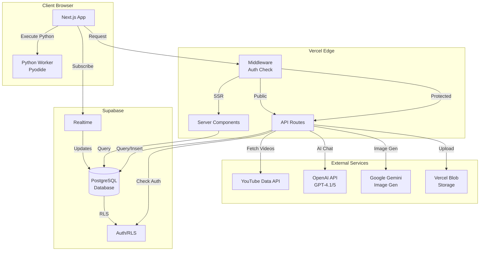
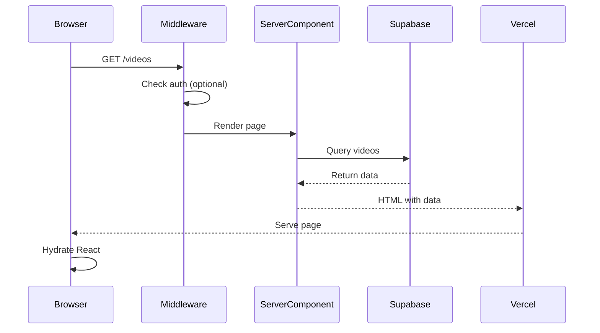
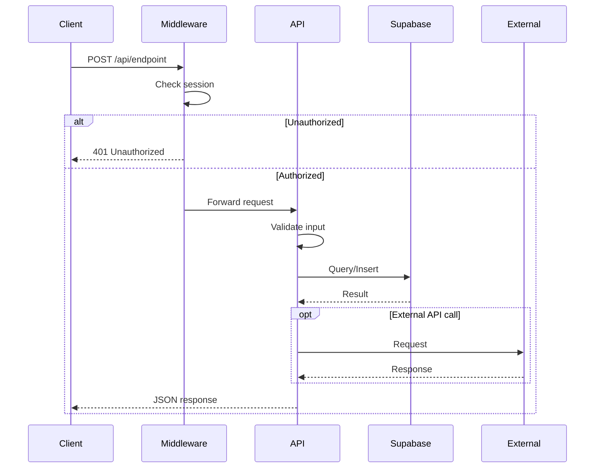
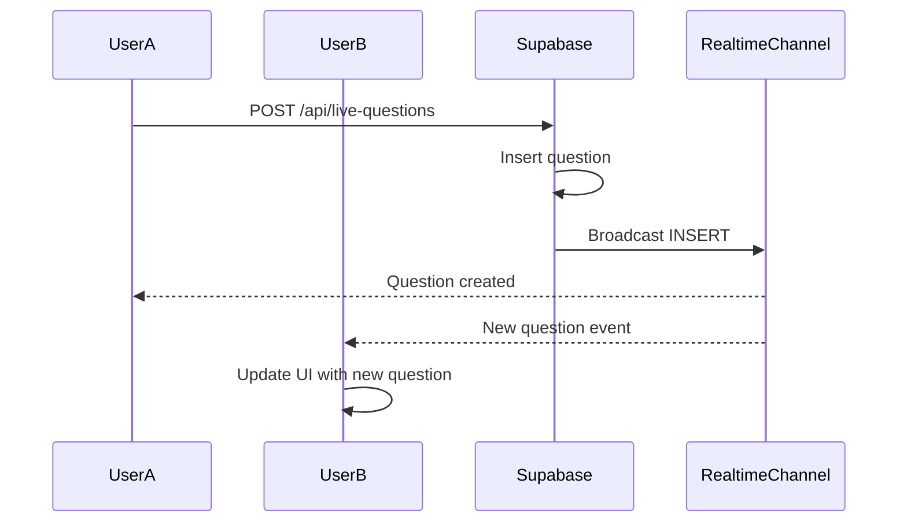
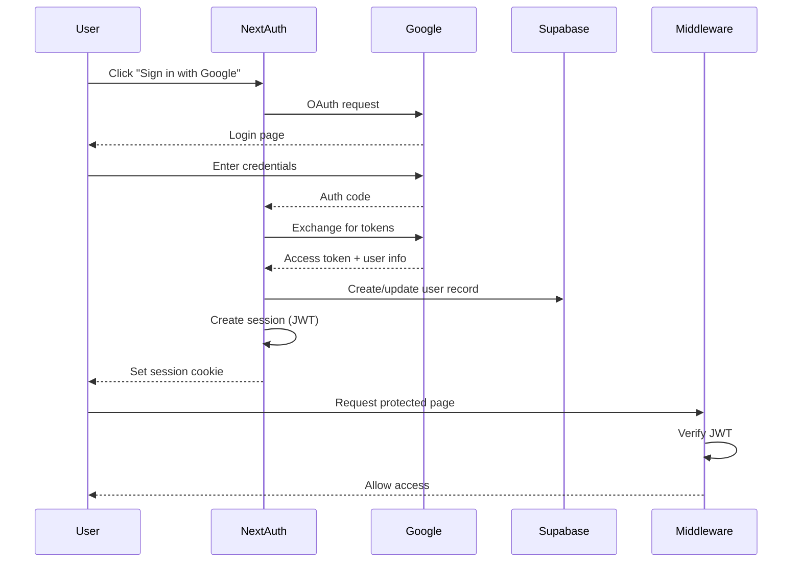
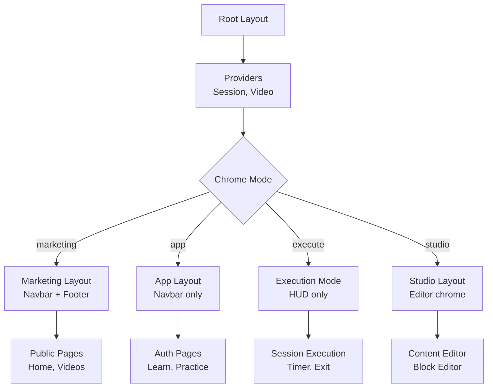
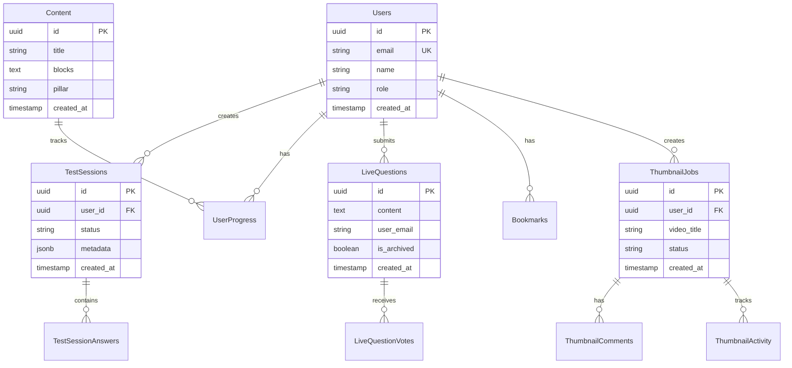

# System Architecture

This document provides a visual and textual overview of the system architecture.

## Table of Contents
- [High-Level Architecture](#high-level-architecture)
- [Data Flow](#data-flow)
- [Authentication Flow](#authentication-flow)
- [Key Technologies](#key-technologies)
- [Component Architecture](#component-architecture)
- [Database Schema](#database-schema)

---

## High-Level Architecture



## System Overview

The application is built as a **Next.js 15 App Router** application deployed on **Vercel**, with:
- **Frontend**: React 19 client components + server components
- **Backend**: Next.js API routes (serverless functions)
- **Database**: Supabase PostgreSQL with Row Level Security (RLS)
- **Authentication**: NextAuth.js with Google OAuth
- **Storage**: Vercel Blob for file uploads
- **AI Services**: OpenAI (chat), Google Gemini (images), Pyodide (Python execution)
- **Real-time**: Supabase Realtime for live questions and updates

---

## Data Flow

### Page Load (SSR)



### API Request (Client)



### Real-time Updates



---

## Authentication Flow



### Authentication Tiers

1. **Public Routes**: No auth required (`/`, `/videos`, `/resources`)
2. **Authenticated Routes**: Valid session required (`/learn`, `/practice`)
3. **Admin Routes**: `UserRole.ADMIN` required (`/admin`, `/thumbnails`)
4. **Editor Routes**: `UserRole.EDITOR` required (`/studio`, `/gallery`)

---

## Key Technologies

### Frontend Stack

| Technology | Version | Purpose |
|------------|---------|---------|
| **Next.js** | 15.3.8 | React framework with App Router |
| **React** | 19.0.0 | UI library |
| **TypeScript** | 5.x | Type safety |
| **Tailwind CSS** | 4.x | Styling (Cinematic Dark Mode) |
| **Framer Motion** | 12.x | Animations |
| **Monaco Editor** | 4.7.0 | Code editor |
| **Mermaid** | 11.x | Diagrams |
| **Pyodide** | (Worker) | Client-side Python execution |

### Backend Stack

| Technology | Version | Purpose |
|------------|---------|---------|
| **Next.js API Routes** | 15.3.8 | Serverless functions |
| **NextAuth.js** | 4.24.11 | Authentication |
| **Supabase** | 2.93.2 | Database + Realtime + Auth |
| **OpenAI SDK** | 6.16.0 | GPT-4.1/5 chat |
| **Google Gemini** | 1.38.0 | AI image generation |
| **Vercel Blob** | 1.1.1 | File storage |

### Developer Tools

| Tool | Purpose |
|------|---------|
| **ESLint** | Code linting |
| **Playwright** | E2E testing |
| **Vitest** | Unit testing |
| **TSX** | TypeScript script runner |
| **GitHub Actions** | CI/CD |

---

## Component Architecture

### Project Structure

```
src/
├── app/                          # Next.js App Router
│   ├── (routes)/                 # Route groups
│   │   ├── page.tsx              # Route page
│   │   └── _components/          # Page-specific components
│   │
│   └── api/                      # API routes (serverless)
│       ├── auth/                 # Authentication
│       ├── chat/                 # AI chat endpoints
│       ├── content/              # CMS endpoints
│       ├── test-session/         # Assessment system
│       └── [feature]/            # Feature-specific APIs
│
├── components/                   # Shared components
│   ├── ui/                       # Generic UI primitives
│   │   ├── Button.tsx
│   │   ├── Modal.tsx
│   │   └── ...
│   │
│   ├── layout/                   # Layout components
│   │   ├── Navbar.tsx
│   │   └── Footer.tsx
│   │
│   ├── editor/                   # Block editor system
│   │   ├── BlockEditor.tsx
│   │   └── hooks/
│   │
│   └── sections/                 # Reusable page sections
│
├── hooks/                        # Custom React hooks
│   ├── usePythonRunner.ts        # Python execution
│   └── useChromeMode.ts          # UI mode detection
│
├── context/                      # React context providers
│   ├── VideoContext.tsx          # Video pagination
│   └── SessionContext.tsx        # Learning session state
│
├── lib/                          # Utilities & clients
│   ├── supabase.ts               # Supabase client
│   ├── youtube.ts                # YouTube API client
│   └── flags.ts                  # Feature flags
│
└── types/                        # TypeScript definitions
    ├── chat.ts
    ├── roles.ts
    └── supabase.ts               # Generated types
```

### Component Hierarchy



### Chrome Modes

The app has **5 chrome modes** that determine UI layout:

1. **Marketing** - Navbar + Footer (public pages, logged out)
2. **App** - Navbar only (logged in, general pages)
3. **Gate** - Session entry point (home page, session mode)
4. **Execute** - Full-screen session mode (timer, minimal UI)
5. **Studio** - Content creation mode (thumbnails, gallery, admin)
6. **Exit** - Session exit flow

**Hook**: `useChromeMode()` determines current mode based on:
- Authentication status
- Current route
- Session state (from SessionContext)
- User role (Admin/Editor)

---

## Database Schema

### Core Tables



### Key Patterns

#### Row Level Security (RLS)
All tables use RLS policies:
- **Public read**: Some tables (LiveQuestions, Content) allow public SELECT
- **User-scoped writes**: Users can only INSERT/UPDATE/DELETE their own data
- **Admin bypass**: Admin users can access all data

**Example Policy**:
```sql
-- Users can read all questions
CREATE POLICY "Anyone can read questions"
  ON LiveQuestions FOR SELECT
  USING (true);

-- Users can insert their own questions
CREATE POLICY "Users can insert questions"
  ON LiveQuestions FOR INSERT
  WITH CHECK (auth.email() = user_email);
```

#### Realtime Subscriptions
Tables with real-time updates:
- `LiveQuestions` - Live Q&A during streams
- `ThumbnailActivity` - Collaborative thumbnail creation
- `TestSessions` - Live progress tracking

**Pattern**:
```typescript
const channel = supabase
  .channel('table-changes')
  .on('postgres_changes', {
    event: '*',
    schema: 'public',
    table: 'TableName'
  }, (payload) => {
    // Handle INSERT, UPDATE, DELETE
  })
  .subscribe();
```

---

## Request Flow Examples

### Example 1: User Submits Chat Message

```
1. User types message in /ai chat
2. Client sends POST /api/chat with messages array
3. Middleware checks NextAuth session
4. API route validates user is authenticated
5. API streams to OpenAI API
6. Response streams back to client
7. Client updates UI with streaming text
8. Message saved to Supabase ChatConversations
```

### Example 2: Live Question Voting

```
1. User clicks vote on question
2. POST /api/live-questions/[id]/vote
3. Middleware checks auth
4. API inserts vote into LiveQuestionVotes
5. Supabase triggers real-time broadcast
6. All connected clients receive update
7. UI updates vote count instantly
```

### Example 3: Python Code Execution

```
1. User writes Python code in editor
2. Client calls usePythonRunner.run(code)
3. Message sent to Python Worker (Pyodide)
4. Worker executes code in WebAssembly
5. stdout/stderr streamed back via postMessage
6. UI updates output in real-time
7. Timeout safety net (5s) prevents hangs
```

### Example 4: File Upload

```
1. User selects file in form
2. Client sends POST /api/upload with FormData
3. Middleware checks auth
4. API validates file type/size
5. File uploaded to Vercel Blob
6. Returns public URL
7. URL saved in database record
```

---

## Performance Considerations

### Caching Strategy

1. **Static Generation (SSG)**: Marketing pages
2. **Server Components**: Data-heavy pages (videos, learn)
3. **Client State**: User interactions, forms
4. **API Cache**: YouTube video data cached (cron refresh)

### Optimization Techniques

- **Infinite scroll**: Videos paginate with 24/page
- **Image optimization**: Next.js automatic image optimization
- **Code splitting**: Dynamic imports for heavy components
- **Streaming**: AI responses stream for perceived performance
- **Web Workers**: Python execution offloaded to worker thread

### Database Indexes

```sql
-- Performance-critical indexes
CREATE INDEX idx_videos_published ON videos(published_at DESC);
CREATE INDEX idx_progress_user ON user_progress(user_id);
CREATE INDEX idx_questions_archived ON live_questions(is_archived, created_at DESC);
CREATE INDEX idx_sessions_user_status ON test_sessions(user_id, status);
```

---

## Security Architecture

### Defense in Depth

1. **Middleware**: First line of defense (auth check)
2. **API Validation**: Input validation in route handlers
3. **RLS Policies**: Database-level access control
4. **Environment Variables**: Secrets never committed
5. **NextAuth**: Secure session management (JWT)
6. **HTTPS Only**: All traffic encrypted in production

### Security Checklist

- ✅ All protected routes check authentication
- ✅ Admin routes verify `UserRole.ADMIN`
- ✅ RLS enabled on all user-data tables
- ✅ Input validation on all API endpoints
- ✅ Secrets stored in environment variables
- ✅ CORS handled by Next.js
- ✅ Content Security Policy configured

---

## Deployment Architecture

### Vercel Deployment

```
Git Push (main branch)
    ↓
GitHub Actions CI
    ├─ Lint
    ├─ Typecheck
    └─ Build
    ↓
Vercel Build
    ├─ Next.js build
    ├─ Environment variables injected
    └─ Deploy to Edge Network
    ↓
Production Live
    ├─ CDN edge caching
    ├─ Serverless functions (API routes)
    └─ Static assets on CDN
```

### Environment Configuration

| Environment | Purpose | URL |
|-------------|---------|-----|
| **Production** | Live site | `peralta.dev` (or configured domain) |
| **Preview** | PR previews | `*.vercel.app` |
| **Development** | Local dev | `localhost:3000` |

### Monitoring

- **Vercel Analytics**: Page views, web vitals
- **Vercel Logs**: Serverless function logs
- **Supabase Dashboard**: Database queries, RLS logs
- **Error Boundaries**: Client-side error catching

---

## Feature Flags

```typescript
// src/lib/flags.ts
export enum FeatureFlags {
  SESSION_MODE = 'session_mode',
  PYTHON_EDITOR = 'python_editor',
  // ... more flags
}

// Usage
const isEnabled = isFeatureEnabled(FeatureFlags.SESSION_MODE, session?.user);
```

Allows gradual rollout of features and A/B testing.

---

## Future Architecture Considerations

### Potential Improvements

1. **Caching Layer**: Add Redis for hot data (video metadata, user sessions)
2. **CDN**: Cloudflare for additional edge caching
3. **Background Jobs**: Bull/BullMQ for async processing
4. **Webhooks**: Receive events from external services
5. **GraphQL**: Consider for complex data fetching
6. **Microservices**: Split heavy features (AI, video processing)

### Scalability Path

```
Current: Monolithic Next.js app
    ↓
Next: Modular monolith (separate concerns)
    ↓
Future: Microservices (AI service, CMS service, etc.)
```

---

## Related Documentation

- **API Routes**: See `docs/API.md`
- **Code Examples**: See `docs/EXAMPLES.md`
- **Design System**: See `.agent/skills/brand-guidelines/SKILL.md`
- **Testing**: See `.agent/skills/webapp-testing/SKILL.md`
- **Database**: See `docs/SUPABASE_PATTERNS.md` (if created)

---

**Last Updated**: 2026-02-14
**Maintained By**: Project team
